# Spice Bureau 2.0

> A Modern, High-Performance Full-Stack Food Delivery Ecosystem.

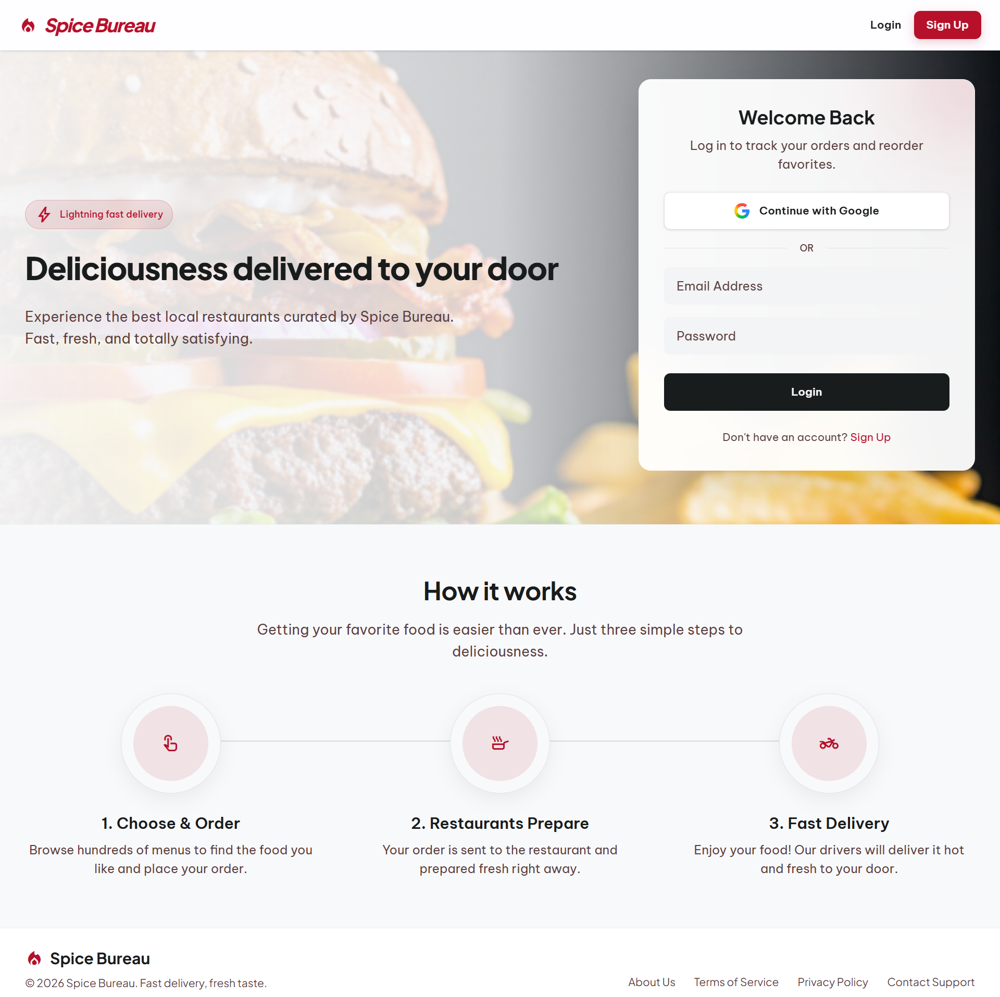

[](https://spice-bureau-8bsg.vercel.app/) 

**Spice Bureau 2.0** is a comprehensive, scalable food delivery platform that seamlessly connects customers, restaurant owners (sellers), delivery personnel (riders), and administrators. Built with a robust microservices architecture and a dynamic, responsive frontend, Spice Bureau aims to provide a premium user experience and efficient operational management for the food delivery industry.


## Gallery & Portals

### Customer Portal
*The Customer Portal allows users to browse restaurants, manage their carts, and track active orders in real-time on an interactive map.* 
<table>
  <tr>
    <td width="50%">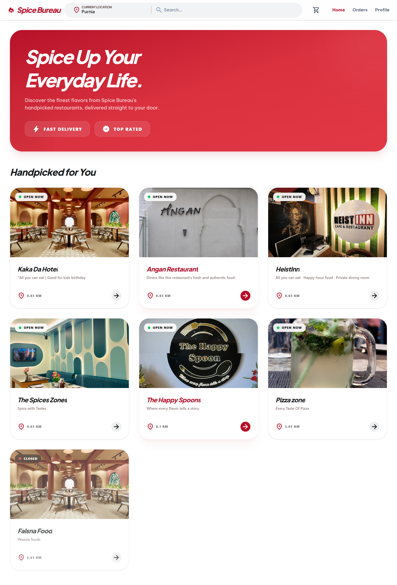</td>
    <td width="50%">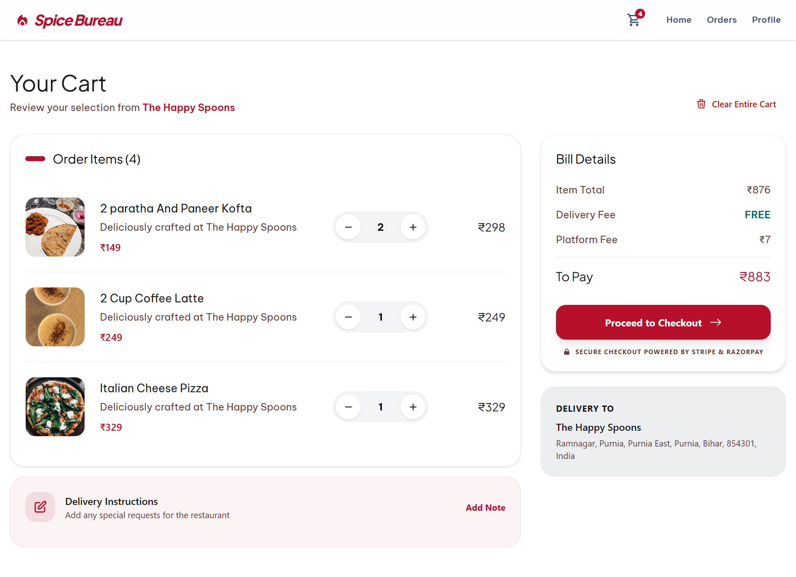</td>
  </tr>
  <tr>
    <td width="50%">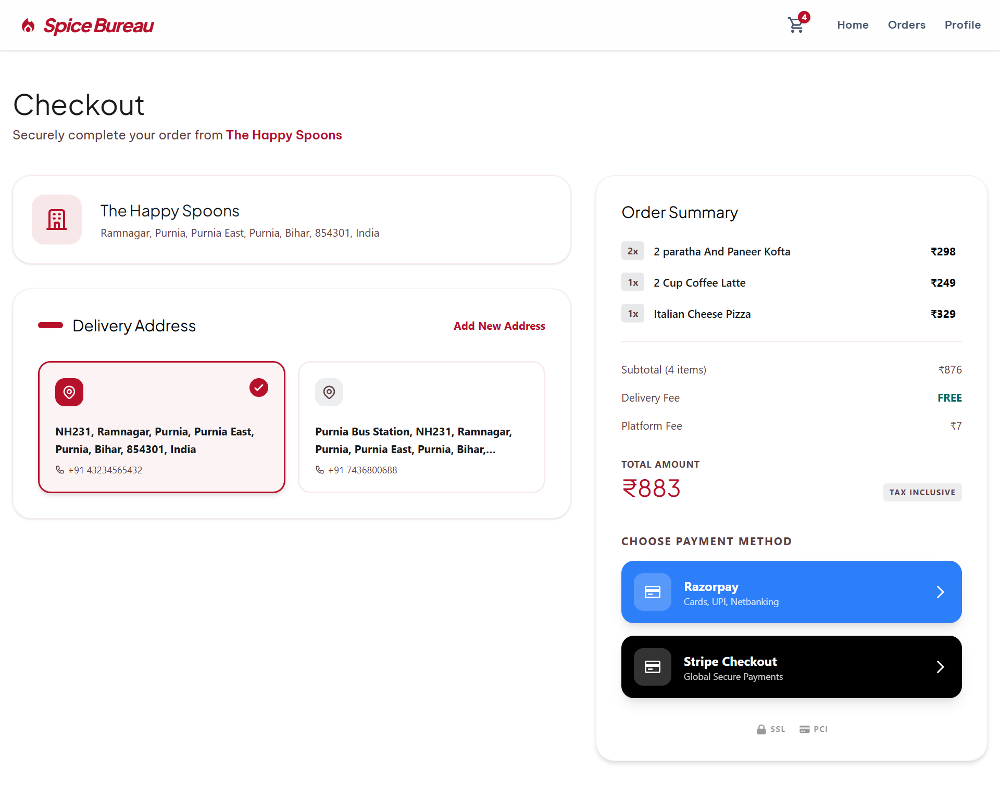</td>
    <td width="50%">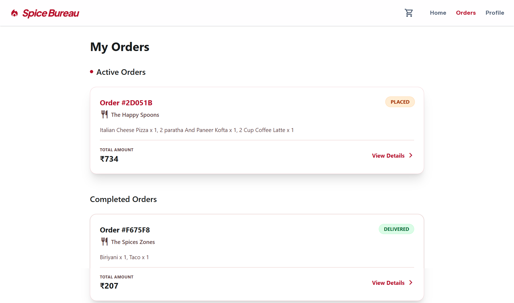</td>
  </tr>
  <tr>
    <td width="50%">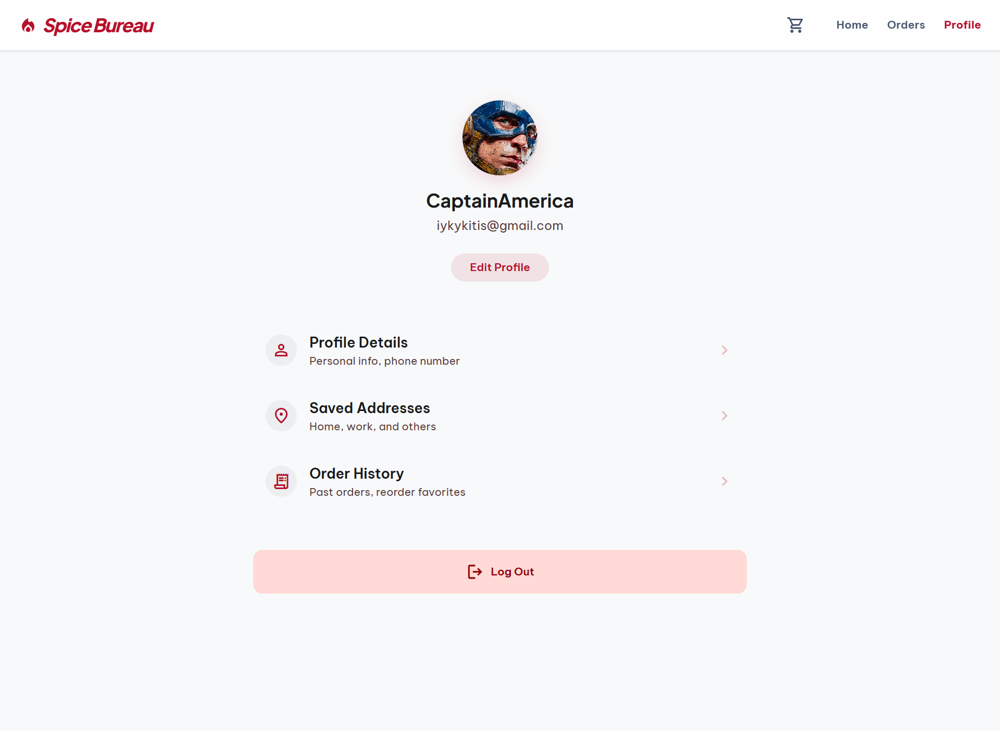</td>
    <td width="50%"></td>
  </tr>
</table>

### Seller (Restaurant) Portal
*A dedicated dashboard for restaurant owners to seamlessly manage menus, receive incoming orders, update order statuses, and track revenue.*
<table>
  <tr>
    <td  width="50%">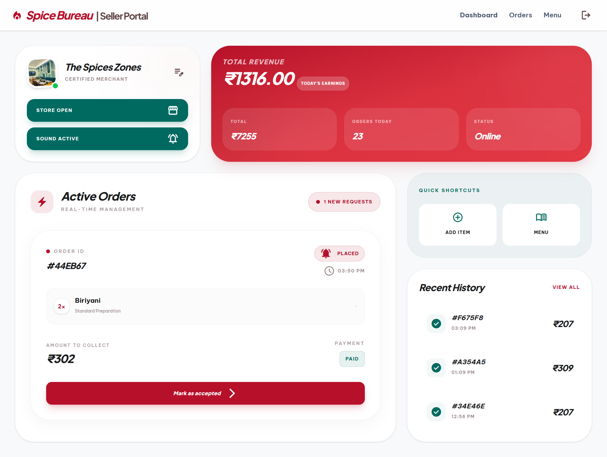</td>
    <td width="50%"></td>
  </tr>
</table>

### Rider Portal
*Empowers delivery personnel to accept delivery requests, utilize live navigation routes, and update delivery progress instantly.*
<table>
  <tr>
    <td width="50%">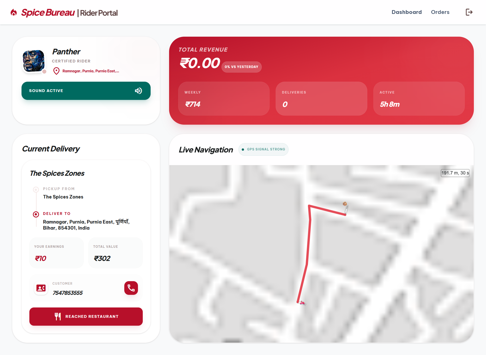</td>
    <td width="50%"></td>
  </tr>
</table>

### Admin Portal
*A high-level oversight platform for administrators to manage all users, approve new restaurants, and monitor platform health and analytics.*
<table>
  <tr>
    <td width="50%">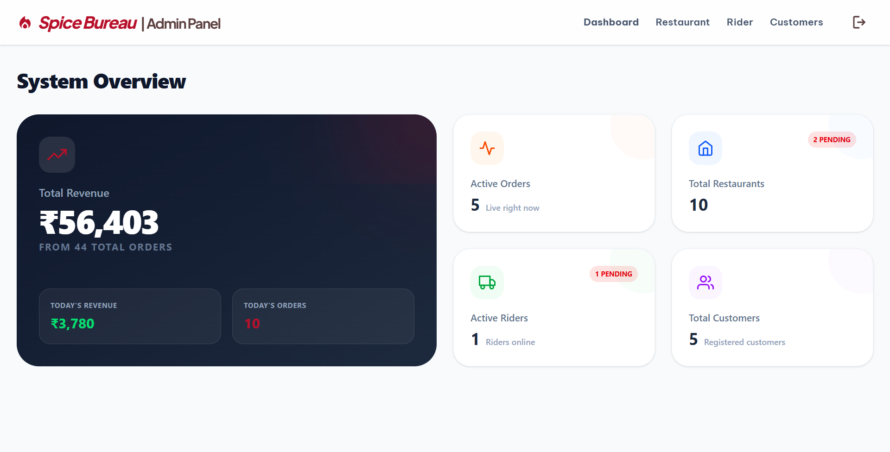</td>
    <td width="50%">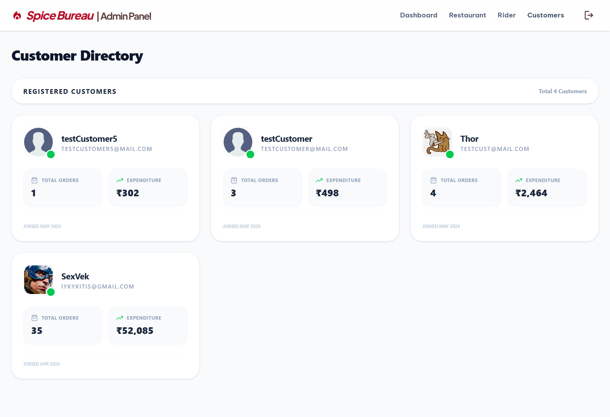</td>
  </tr>
  <tr>
    <td width="50%">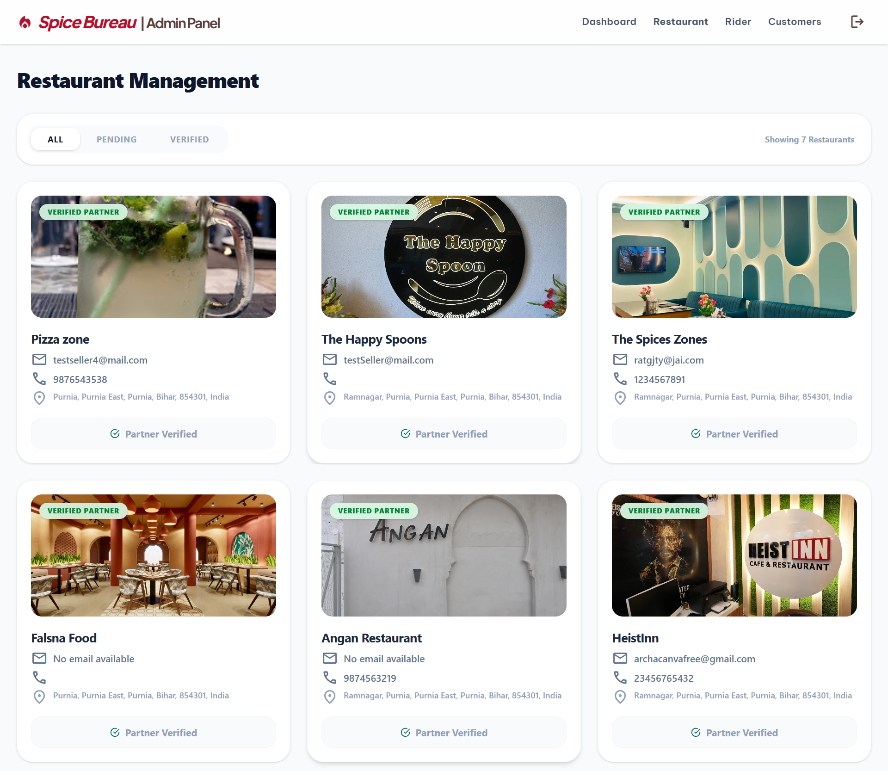</td>
    <td width="50%">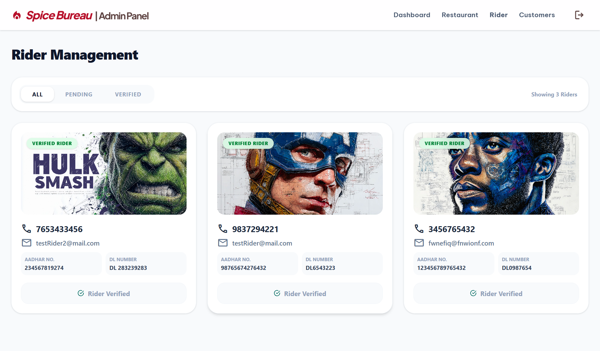</td>
  </tr>
</table>


## Key Features

- **Customer Portal**: Browse extensive menus, search for restaurants, manage carts, enjoy real-time order tracking with interactive maps, secure checkout via Stripe and Razorpay, and seamless Google OAuth authentication.
- **Seller (Restaurant) Portal**: Comprehensive menu management, real-time order receiving and processing, status updates, and business performance analytics.
- **Rider Portal**: Accept delivery requests, utilize real-time navigation and routing using Leaflet, update delivery statuses instantly, and manage earnings.
- **Admin Portal**: Platform-wide oversight, comprehensive user management, restaurant approvals, and deep system analytics.


## Tech Stack & Architecture Decisions

Spice Bureau is built using modern, industry-standard technologies chosen for scalability, performance, and developer experience.

### Frontend
- **React 19 & TypeScript**: Chosen for building a robust, type-safe, and highly interactive user interface. TypeScript significantly reduces runtime errors and improves code maintainability across a large codebase.
- **Vite**: Replaced create-react-app or Webpack for its lightning-fast Hot Module Replacement (HMR) and optimized build times, significantly speeding up the development workflow.
- **TailwindCSS 4.2**: A utility-first CSS framework used for rapid UI development. It ensures a highly responsive, modern, and consistent design system without the bloat of traditional CSS stylesheets.
- **React Router DOM v7**: Manages complex routing across the four distinct portals (Customer, Seller, Rider, Admin) seamlessly.
- **Leaflet & React-Leaflet**: Open-source interactive maps. Used extensively in the Rider portal for delivery navigation and in the Customer portal for live order tracking.
- **Stripe & Razorpay Integration**: Chosen for their robust, secure, and developer-friendly payment processing APIs.
  - *Result / Use Case*: They ensure a seamless and highly secure checkout experience. Upon payment success, these gateways securely trigger the internal order pipeline, confirming the transaction before the restaurant begins preparing the food, effectively eliminating fraudulent or unpaid orders.
- **Google OAuth**: Reduces signup friction by allowing secure, 1-click authentication.

### Backend (Microservices Architecture)
Instead of a monolithic backend, Spice Bureau utilizes a **Microservices Architecture** built with **Node.js** and **Express (v5)**. This allows independent scaling, fault isolation, and easier maintenance of different business domains.

- **MongoDB (via Mongoose)**: A NoSQL database was chosen for its flexibility with schema design. It is perfectly suited for storing highly variable data like dynamic restaurant menus, diverse user profiles, and complex order structures.
- **RabbitMQ (`amqplib`)**: Crucial for reliable, asynchronous service-to-service communication. *Use Case*: When a customer places an order (Restaurant Service), a message is pushed to a RabbitMQ queue to notify the Rider Service to find a driver, all without blocking the main HTTP thread.
- **Socket.io**: Enables real-time, bi-directional communication between the server and clients. *Use Case*: Used extensively for live order tracking, instant notifications for restaurants when a new order arrives, and driver location updates.
- **JWT & Bcrypt**: Ensures stateless, secure authentication and password hashing across all microservices.

#### Microservices Breakdown:
1. **Auth Service**: Manages user registration, login, JWT issuance, security, and Google OAuth integration.
2. **Restaurant Service**: Handles restaurant profiles, menu items, and complex order processing for sellers.
3. **Rider Service**: Manages rider profiles, delivery assignments, and live tracking capabilities.
4. **Admin Service**: Platform administration, data aggregation, and elevated privilege actions.
5. **Realtime Service**: Dedicated WebSocket server for live order tracking, instant notifications, and chat.
6. **Utils**: Shared configurations, common middlewares, and utility functions across all services.


## How to Run Locally

### Prerequisites
Before you begin, ensure you have the following installed and configured on your machine:
- [Node.js](https://nodejs.org/) (v18 or higher recommended)
- [MongoDB](https://www.mongodb.com/) (Local instance or MongoDB Atlas cluster)
- [RabbitMQ](https://www.rabbitmq.com/) (Running locally or via Docker)
- A **Stripe Account** (for payment gateway API keys)
- A **Google Cloud Console Project** (for OAuth 2.0 credentials)

### 1. Clone the Repository
```bash
git clone https://github.com/thorcha-errox/spice-bureau.git
cd spice-bureau
```

### 2. Setup Environment Variables
You need to create a `.env` file in the `frontend` directory and inside each service under the `services/` directory. Below are the required variables for each specific service (replace values with your own configurations).

#### Frontend (`frontend/.env`)
```env
VITE_STRIPE_PUBLISHABLE_KEY=your_stripe_public_key
VITE_INTERNAL_SERVICE_KEY=your_internal_secret_key
```

#### Auth Service (`services/auth/.env`)
```env
PORT=5000
MONGO_URI=your_mongodb_connection_string
JWT_SEC=your_jwt_secret
GOOGLE_CLIENT_ID=your_google_oauth_client_id
GOOGLE_CLIENT_SECRET=your_google_oauth_client_secret
```

#### Restaurant Service (`services/restaurant/.env`)
```env
PORT=5001
MONGO_URI=your_mongodb_connection_string
JWT_SEC=your_jwt_secret
UTILS_SERVICE=http://localhost:5002
REALTIME_SERVICE=http://localhost:5004
INTERNAL_SERVICE_KEY=your_internal_secret_key
RABBITMQ_URL=amqp://your_rabbitmq_url
PAYMENT_QUEUE=payment_event
RIDER_QUEUE=rider_queue
ORDER_READY_QUEUE=order_ready_queue
```

#### Rider Service (`services/rider/.env`)
```env
PORT=5005
MONGO_URI=your_mongodb_connection_string
JWT_SEC=your_jwt_secret
UTILS_SERVICE=http://localhost:5002
REALTIME_SERVICE=http://localhost:5004
RESTAURANT_SERVICE=http://localhost:5001
INTERNAL_SERVICE_KEY=your_internal_secret_key
RABBITMQ_URL=amqp://your_rabbitmq_url
RIDER_QUEUE=rider_queue
ORDER_READY_QUEUE=order_ready_queue
```

#### Admin Service (`services/admin/.env`)
```env
PORT=5006
MONGO_URI=your_mongodb_connection_string
JWT_SEC=your_jwt_secret
DB_NAME=your_database_name
```

#### Realtime Service (`services/realtime/.env`)
```env
PORT=5004
JWT_SEC=your_jwt_secret
INTERNAL_SERVICE_KEY=your_internal_secret_key
```

### 3. Install Dependencies & Start Services
Since Spice Bureau utilizes a microservices architecture, you will need to start the frontend and each backend service individually.

**Frontend:**
```bash
cd frontend
npm install
npm run dev
```

**Backend Services:**
Open a separate terminal for **each** service (`auth`, `restaurant`, `rider`, `admin`, `realtime`) and run:
```bash
cd services/<service_name>
npm install
npm run dev
```

*(Note: Ensure MongoDB and RabbitMQ are actively running before starting the backend services to prevent connection timeouts.)*


## Future Scope & Roadmap

While Spice Bureau 2.0 is fully functional, continuous improvement is in our DNA. Here are the upcoming features and technical enhancements planned for the future:

- **Dockerization**: Containerize all microservices and the frontend using Docker and Docker Compose for a seamless, one-click local setup and streamlined deployment pipeline.
- **Kubernetes Orchestration**: Implement K8s for robust auto-scaling, load balancing, and managing the microservices securely in a high-traffic production environment.
- **Advanced AI Analytics**: Integrate machine learning algorithms for personalized food recommendations, dynamic pricing, and predictive delivery time estimations.
- **Multi-Language Support (i18n)**: Implement internationalization to cater to a global audience.
- **Mobile Applications**: Port the responsive web portals to native mobile applications for iOS and Android using React Native.
- **Advanced Push Notifications**: Integrate sophisticated web and mobile push notifications for instant order and delivery status updates.


## Contributing
Contributions, bug reports, and feature requests are highly welcome! 
If you'd like to contribute, please fork the repository and use a feature branch. Pull requests are warmly welcomed.

## License
This project is licensed under the [MIT License](LICENSE).

*Crafted with passion for the ultimate food delivery experience.*
